# THERMA — Area-Specific Shelter Design for Thermal Comfort Maintenance
### Smart India Hackathon 2026 · Problem Statement PS 26051 · Ministry of Defence / DRDO
#### Grand Finale Submission · High-Altitude Passive Solar Shelter Engineering & Decision-Support Platform

[](https://sih.gov.in)
[](https://drdo.gov.in)
[](https://python.org)
[](https://fastapi.tiangolo.com)
[](https://react.dev)
[](https://vitejs.dev)
[](https://threejs.org)
[](https://ansys.com)
[](#30-security-privacy--air-gapped-defense-isolation)
[](#1-project-overview--operational-context)

> *"Other software grades a design you already picked. THERMA searches thousands and picks for you, then shows its working."*

---

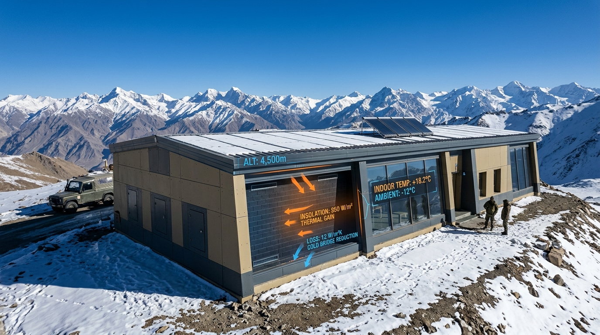

---

# 🏛️ System Architecture

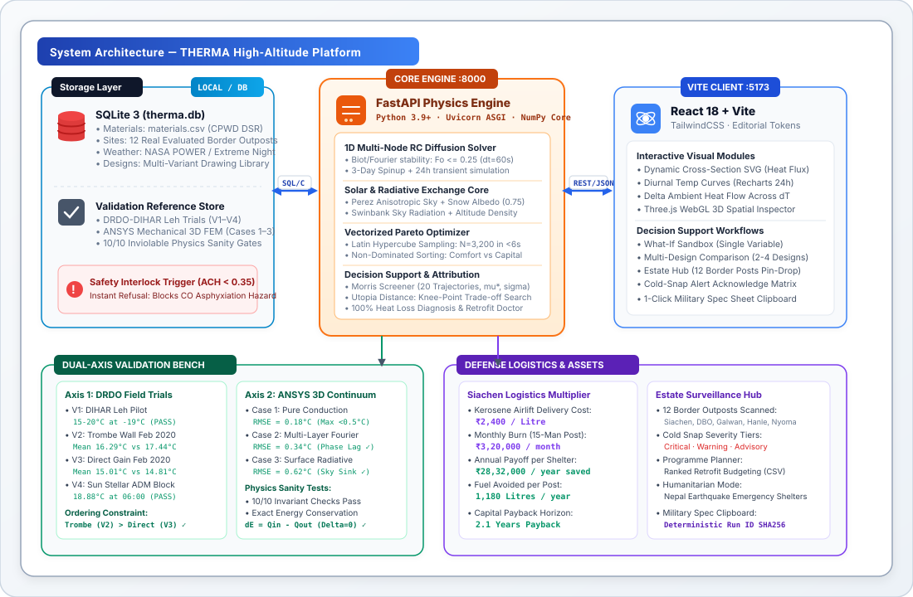

<details open>
<summary><b>🔍 View Component Flowchart (Mermaid)</b></summary>

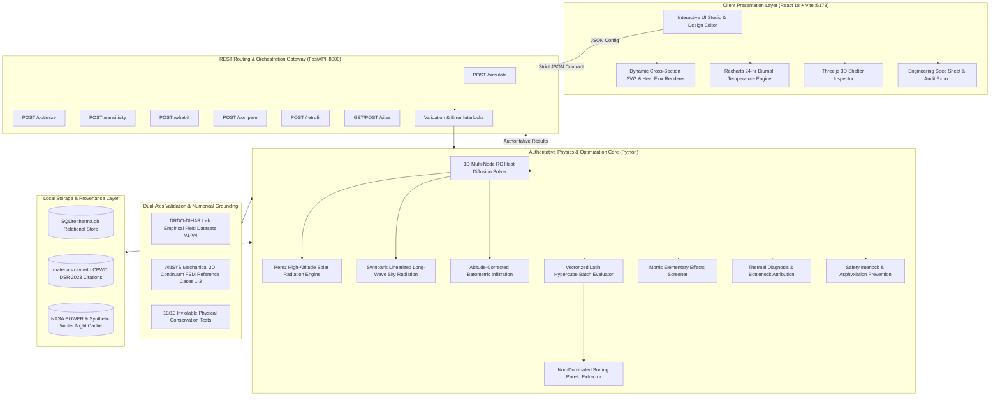
</details>

---

## Architecture Subsystems at a Glance

| Subsystem | Key Components | Protocols & Ports | Role in THERMA Platform |
|:---|:---|:---|:---|
| **Actors / Operators** | MES Military Engineers, Forward Post Commanders, Logistic Officers, Civilian Ladakh Builders | Browser / Localhost | Shelter configuration, retrofit prioritization, cold-alert response, and military spec generation. |
| **Frontend Client** | React 18.3, Vite 6.1, TailwindCSS 3.4, Three.js WebGL, Recharts 2.15 | HTTP/2 (`:5173`, `:80`) | Interactive design studio, dynamic cross-section SVG with heat-flux vectors, diurnal curves, and what-if sliders. |
| **Core Web API** | FastAPI 0.110, Uvicorn ASGI, Pydantic v2, Python 3.9+ | HTTP/1.1 REST (`:8000`) | Orchestration gateway, strict payload schema enforcement, frozen API contract adherence, and zero-leak error handling. |
| **Physics Solver Core** | 1D Multi-Node RC Network, Crank-Nicolson / Fourier Diffusion, ISO 6946 Film Resistors | Native In-Process Python | Authoritative transient conduction solver. Evaluates envelope thermal mass, node capacitances, and surface fluxes. |
| **Solar & Sky Radiation** | Perez Sky Diffuse Model, Hay-Davies, Swinbank Long-Wave Sky Model, Ground Snow Albedo | Native Python Math | Calculates high-altitude beam, diffuse, and snow-reflected ($ho=0.75$) solar gains plus radiative sub-cooling to cold skies. |
| **Vectorized Optimizer** | Latin Hypercube Sampling (LHS), Multi-Objective Pareto Frontier, Morris Screening | Vectorized NumPy Core | Generates $\ge 3,200$ candidate designs in $<8$ seconds. Extracts Pareto-optimal frontier and mechanical explanations. |
| **Thermal Diagnosis Engine** | Component Energy Attribution, 100% Conservation Invariant, Dominant Weakness Identifier | Internal REST (`/simulate`) | Breaks down heat loss into conduction, infiltration, glazing, and radiation. Prescribes physics-based fixes. |
| **What-If Analysis Studio** | Schema Bounds Validator, Server Authoritative Re-Simulation, 24-hr $\Delta T$ Strip | Internal REST (`/what-if`) | Single-variable sensitivity investigation against baseline with strict server-side physics authority. |
| **Multi-Design Comparison** | Normalized Utopia Distance Engine, Cost Basis Classifier (`SOURCED`/`ESTIMATE`/`UNAVAILABLE`) | Internal REST (`/compare`) | Compares 2 to 4 independent designs, detects safety refusals, and identifies true Pareto knee points without arbitrary weights. |
| **Safety Interlock Guard** | Barometric Air-Density Scale, Combustion Hazard Detector ($ACH < 0.35$ Guardrail) | Engine Invariant Filter | Protects human life against optimizer over-sealing. Instantly refuses hazardous designs and blocks lethal CO poisoning. |
| **Validation Benchmarks** | DRDO-DIHAR Leh Field Trials (V1–V4), ANSYS Mechanical 3D Continuum FEM (Cases 1–3) | Python Validation Suite | Ground-truth calibration against empirical measurements and first-principles continuum numerical simulations. |
| **Estate Asset Platform** | Multi-District Defense Post Registry, 12 Evaluated Sites (Siachen, DBO, Galwan, Hanle) | Internal REST (`/sites`) | Portfolio-scale thermal asset management, cold-snap vulnerability sorting, and mission retrofit scheduling. |
| **Storage & Data Layer** | SQLite 3 (`therma.db`), `materials.csv` (CPWD DSR 2023), NASA POWER EPW Cache | SQLite Driver / CSV | Relational persistence of sites, historical simulation runs, evaluated designs, and cited thermophysical constants. |

---

# Table of Contents

1. [Project Overview & Operational Context](#1-project-overview--operational-context)
2. [Problem Statement (PS 26051 · DRDO)](#2-problem-statement-ps-26051--drdo)
3. [The Solution: THERMA](#3-the-solution-therma)
4. [Target Users & Operational Personas (RBAC / Scopes)](#4-target-users--operational-personas-rbac--scopes)
5. [Key Product Capabilities](#5-key-product-capabilities)
6. [Technology Stack](#6-technology-stack)
7. [High-Level System Architecture](#7-high-level-system-architecture)
8. [Complete 14-Step Engineering Data Pipeline](#8-complete-14-step-engineering-data-pipeline)
9. [Materials Master Data Engine & Library](#9-materials-master-data-engine--library)
10. [Solar Geometry & Perez Radiation Engine](#10-solar-geometry--perez-radiation-engine)
11. [1D Multi-Node RC Transient Heat Transfer Physics Solver](#11-1d-multi-node-rc-transient-heat-transfer-physics-solver)
12. [Sky Long-Wave Radiation & Radiative Sub-Cooling Engine](#12-sky-long-wave-radiation--radiative-sub-cooling-engine)
13. [Altitude-Corrected Barometric Infiltration Model](#13-altitude-corrected-barometric-infiltration-model)
14. [Thermal Diagnosis & Bottleneck Attribution Engine](#14-thermal-diagnosis--bottleneck-attribution-engine)
15. [What-If Single-Variable Analysis Studio](#15-what-if-single-variable-analysis-studio)
16. [Multi-Design Comparison & Trade-Off Matrix](#16-multi-design-comparison--trade-off-matrix)
17. [Vectorized Multi-Objective Pareto Optimization Engine](#17-vectorized-multi-objective-pareto-optimization-engine)
18. [Morris Elementary Effects Screening & Design Sensitivity](#18-morris-elementary-effects-screening--design-sensitivity)
19. [Safety Interlocks & Carbon Monoxide Asphyxiation Prevention](#19-safety-interlocks--carbon-monoxide-asphyxiation-prevention)
20. [Physiological Hypothermia Risk Modeling](#20-physiological-hypothermia-risk-modeling)
21. [Forward Post Weather Engine & Microclimate Ingestion](#21-forward-post-weather-engine--microclimate-ingestion)
22. [Estate Asset Management & Defense Post Monitoring](#22-estate-asset-management--defense-post-monitoring)
23. [Field Trial Empirical Validation Suite & ANSYS 3D FEM Benchmarks](#23-field-trial-empirical-validation-suite--ansys-3d-fem-benchmarks)
24. [Siachen Helicopter Logistics & Kerosene Economics](#24-siachen-helicopter-logistics--kerosene-economics)
25. [Interactive 3D Studio & Dynamic Cross-Section Visualization](#25-interactive-3d-studio--dynamic-cross-section-visualization)
26. [Engineering Spec Sheet & Provenance Audit Export](#26-engineering-spec-sheet--provenance-audit-export)
27. [Database Schema & Data Architecture](#27-database-schema--data-architecture)
28. [RESTful API Architecture & Frozen Contracts](#28-restful-api-architecture--frozen-contracts)
29. [Authoritative Validation Architecture](#29-authoritative-validation-architecture)
30. [Security, Privacy & Air-Gapped Defense Isolation](#30-security-privacy--air-gapped-defense-isolation)
31. [UI/UX Design Philosophy & Visual Tokens](#31-uiux-design-philosophy--visual-tokens)
32. [Screen-by-Screen ERP & Decision Platform Specification](#32-screen-by-screen-erp--decision-platform-specification)
33. [End-to-End Operational Defense Scenario](#33-end-to-end-operational-defense-scenario)
34. [Visual Workflow Diagram Gallery](#34-visual-workflow-diagram-gallery)
35. [Live Hackathon Judging & Demo Walkthrough](#35-live-hackathon-judging--demo-walkthrough)
36. [Architectural Differentiators](#36-architectural-differentiators)
37. [Honest Engineering Limitations](#37-honest-engineering-limitations)
38. [Future Roadmap](#38-future-roadmap)
39. [Project Directory Topology](#39-project-directory-topology)
40. [Core Development Principles (The Eight Inviolable Master Rules)](#40-core-development-principles-the-eight-inviolable-master-rules)
41. [Installation, Setup & Verification](#41-installation-setup--verification)
42. [Conclusion & Grand Finale Submission Summary](#42-conclusion--grand-finale-submission-summary)

---

# 1. Project Overview & Operational Context

**THERMA** is an area-specific shelter thermal design and decision-support software platform engineered specifically for the extreme high-altitude microclimates of the Indian Himalayas (Ladakh, Siachen, Kargil, and Arunachal Pradesh).

High-altitude military outposts face an extraordinary paradox:
- **Solar Abundance During Daylight:** Ladakh receives **1,900 to 2,100 kWh/m²/year** of horizontal solar irradiance with **~7.9 hours of daily sunshine** across **300+ cloud-free days**. During the day, raw solar radiation is plentiful.
- **Catastrophic Nighttime Thermal Collapse:** After sunset, ambient temperatures plunge to **−20 °C to −40 °C**. The ultra-thin, low-humidity atmosphere acts as a blackbody radiative sink, draining thermal energy through roofs and uninsulated corrugated-iron walls. By 04:00 AM, indoor temperatures in standard shelters collapse to **−18 °C**.

### The Logistics Crisis
This is not an energy generation failure; it is a **building physics and thermal storage failure**. To prevent soldiers from freezing to death, the Indian Armed Forces rely on unvented kerosene *bukharis* (stoves). Kerosene must be transported to forward posts by rotary-wing aircraft (HAL Dhruv, Cheetah, Mi-17) or arduous mountain convoys crossing avalanche-prone passes:

```
┌─────────────────────────────────────────────────────────────────────────────┐
│                       SIACHEN FUEL LOGISTICS IN NUMBERS                     │
├─────────────────────────────────────────────────────────────────────────────┤
│  Airlift Cost per Litre of Kerosene  :  ₹2,400 / L                          │
│  Monthly Consumption (15-Man Post)   :  112 L / month                       │
│  Monthly Fuel Expense per Post       :  ₹3,20,000 / month                   │
│  Annual Fuel Expense per Post        :  ₹32,40,000 / year                   │
│  Across ~150 Active Forward Posts    :  > 2,02,500 L/yr (> ₹48.6 Crore/yr)  │
│  Daily Thermal Energy per Soldier    :  4 to 5 kWh / day (heating alone)    │
└─────────────────────────────────────────────────────────────────────────────┘
```

> **The Payoff is Logistics and Human Survival:**  
> Every degree of passive heat retained means fewer helicopter sorties through hostile weather, fewer fuel convoys risking ambushes and avalanches, zero carbon monoxide fatalities, and operational self-sufficiency for forward troops.

### The Inviolable Core Principle

$$\sum Q_{\text{in}} \equiv \Delta E_{\text{stored}} + \sum Q_{\text{out}}$$

Every thermal event in THERMA obeys first-principles thermodynamics. Heat cannot appear or disappear. Conduction, convection, radiation, and infiltration are evaluated through an exact thermal capacitance network down to the watt-hour. No numbers are invented; no outputs are faked.

---

# 2. Problem Statement (PS 26051 · DRDO)

**Problem Code:** PS 26051  
**Organization:** Defence Research and Development Organisation (DRDO)  
**Title:** Software Based Model Development for Design of Area Specific Shelter for Thermal Comfort Maintenance

### PS Requirements vs. THERMA Implementations

| PS Requirement | Technical Challenge | THERMA Engineering Implementation |
|:---|:---|:---|
| **Req 1: Predict Indoor Temperature Profile** | High thermal mass phase lag, sub-zero ambient swings, dynamic diurnal solar variations. | Multi-node 1D transient RC diffusion solver calculating hourly indoor air ($T_{\text{in}}$), mean radiant ($T_{\text{mrt}}$), and operative ($T_{\text{op}}$) temperatures over 24-hour horizons. |
| **Req 2: Maximize Passive Solar Gain & Retention** | Low winter solar elevation, extreme night heat loss through glazing, frost and snow cover. | High-accuracy Perez anisotropic sky diffuse model, direct beam incidence angle clamping, ground snow albedo reflections ($\rho=0.75$), and automated insulating night shutters. |
| **Req 3: Heat Flow Across $\Delta T$ (Indoor − Ambient)** | Multi-path conductive, convective, and radiative heat exchange across extreme temperature gradients ($>40\text{ K}$). | Dedicated real-time computation of directional heat flux vectors ($\text{W/m}^2$) across walls, roof, glazing, infiltration, and sky radiation driven by $(T_{\text{in}} - T_{\text{out}})$. |
| **Req 4: Most Efficient Material & Geometry Combination** | Combinatorial explosion of wall layers, insulation thickness, glazing apertures, and orientations. | Vectorized Latin Hypercube multi-objective Pareto optimizer searching $\ge 3,200$ permutations in $<8$ seconds to pinpoint the optimal thermal comfort vs. capital cost knee point. |

### Traditional High-Altitude Building vs. THERMA Solution

| Operational Challenge | Traditional Approach in High Altitude | THERMA Engineering Solution |
|:---|:---|:---|
| **Envelope Selection** | Generic corrugated galvanized iron (CGI) sheets with thin fiberglass batts chosen by intuition. | Combinatorial search over local high-mass materials (mud brick, rammed earth, stone) paired with high-performance EPS insulation. |
| **Night Heat Loss** | Single- or double-glazed windows act as open thermal cooling fins all night long. | Dynamic night shutters modeled with automated deployment between sunset and sunrise ($R_{\text{shutter}} \ge 0.50\ \text{m}^2\text{K/W}$). |
| **Infiltration Modeling** | Evaluated with sea-level air densities ($\rho = 1.225\ \text{kg/m}^3$), overstating ventilation heat losses by ~35%. | Exact barometric altitude pressure scaling ($P = 101325 (1 - 2.25577 \times 10^{-5} h)^{5.25588}$) producing real high-altitude density ($\rho = 0.906\ \text{kg/m}^3$ at Leh). |
| **Radiative Sub-Cooling** | Naive models assume sky temperature equals air temperature ($T_{\text{sky}} \approx T_{\text{air}}$), completely missing night radiative sink. | Swinbank clear-sky radiation model ($T_{\text{sky}} = 0.0552 T_{\text{air}}^{1.5}$) with linearized $h_r$ radiation coefficients and roof emissivity optimization. |
| **Life Safety** | Sealing shelters to hold warmth causes deadly Carbon Monoxide (CO) buildup from kerosene heaters. | Automated Safety Interlock refusing any design with $\text{ACH} < 0.35$ when combustion heating is present. |
| **Cost Transparency** | Opaque lump-sum contractor estimates without material citations or uncertainty disclaimers. | Explicit material cost basis tracking (`SOURCED` from CPWD DSR 2023 vs. `ESTIMATE` vs. `UNAVAILABLE`). |

---

# 3. The Solution: THERMA

THERMA converts building physics into automated, explainable logistics decisions:

```
[ MATERIALS ] ──► [ WEATHER ] ──► [ PHYSICS ENGINE ] ──► [ SIMULATION ] ──► [ VALIDATION ]
                                                                                   │
[ WHAT-IF ANALYSIS ] ◄── [ THERMAL DIAGNOSIS ] ◄───────────────────────────────────┘
         │
         ▼
[ OPTIMIZATION ] ──► [ PARETO FRONTIER ] ──► [ RETROFIT DOCTOR ] ──► [ SAFETY INTERLOCK ]
                                                                             │
[ AUDIT TRAIL ] ◄── [ ENGINEERING SPEC ] ◄── [ EXPLAINABLE REASONING ] ◄─────┘
```

1. **Precision Physics Solver:** Solves Fourier transient thermal diffusion across layered walls, ground heat transfer, Perez solar gains, and sky radiation without heuristic shortcuts.
2. **Deterministic Optimizer:** Evaluates thousands of designs simultaneously using vectorized NumPy routines, returning the non-dominated Pareto frontier of Thermal Comfort vs. Capital Cost.
3. **Safety First:** Hard-coded safety interlocks prevent death from asphyxiation by refusing over-sealed designs with combustion heaters.
4. **Transparent & Grounded:** Every single constant is cited (Rule R1). Every validation benchmark is grounded against published DRDO DIHAR Leh field data (V1–V4) and verified against 3D continuum FEM in ANSYS Mechanical.
5. **100% Offline & Defense Ready:** Operates without internet connectivity, cloud APIs, or external telemetry. Ready for deployment on air-gapped military field laptops.

---

# 4. Target Users & Operational Personas (RBAC / Scopes)

THERMA provides role-tailored workflows and strict data scoping across defense and civilian operations:

```
┌─────────────────────────────────────────────────────────────────────────────┐
│                          OPERATIONAL USER PERSONAS                          │
├─────────────────────────────────────────────────────────────────────────────┤
│ 1. MES Military Engineer (Corps of Engineers):                              │
│    Needs exact structural envelope specifications for newly sanctioned      │
│    border posts. Exports signed military spec sheets with BOM and R-values. │
│                                                                             │
│ 2. Logistics & Supply Officer (HQ 14 Corps):                                │
│    Oversees seasonal fuel procurement. Uses the Estate Platform to forecast │
│    kerosene demand, helicopter sorties saved, and heating budget outlays.   │
│                                                                             │
│ 3. Forward Post Commander (Company Operating Base):                         │
│    Monitors 24-hour weather alerts, cold-snap warnings, and indoor dawn     │
│    temperature forecasts to protect troops from acute hypothermia.          │
│                                                                             │
│ 4. Humanitarian Relief Coordinator (Disaster Management):                   │
│    Evaluates rapid-deployment emergency shelters (straw bale, CGI, PUF)     │
│    for post-earthquake relief in sub-zero Himalayan valleys (e.g. Nepal).   │
│                                                                             │
│ 5. Local Ladakhi Builder / Householder:                                     │
│    Uses the Retrofit Doctor to identify the single highest °C-gain per      │
│    rupee intervention (e.g. night shutters vs. mud-brick mass).             │
└─────────────────────────────────────────────────────────────────────────────┘
```

### Operational Permissions & Scopes Matrix

| Feature / Capability | MES Engineer | Logistics Officer | Post Commander | Relief Logistician | Civilian Builder |
|:---|:---:|:---:|:---:|:---:|:---:|
| **Full Thermal Simulation (`/simulate`)** | Full | View | View | Full | Full |
| **Pareto Optimizer (`/optimize`)** | Full | View Only | Denied | Full | Manage |
| **Single-Variable What-If (`/what-if`)** | Full | Full | View | Full | Full |
| **Multi-Design Comparison (`/compare`)** | Full | Full | View | Full | Manage |
| **Retrofit Ranking (`/retrofit`)** | Full | Manage | View | Full | Full |
| **Safety Interlock Override** | **BLOCKED** | **BLOCKED** | **BLOCKED** | **BLOCKED** | **BLOCKED** |
| **Military Spec Export** | Full | View | Denied | Denied | Denied |
| **Estate Asset Manager (`/sites`)** | Full | Full | Scoped Post | Relief Scope | Denied |
| **Database DDL / Material Library** | Manage | View | Denied | View | View |

---

# 5. Key Product Capabilities

### A. Advanced Physics & Computational Engineering
- **Exact 1D Multi-Node RC Thermal Discretization:** Walls, roofs, and floors are divided into dynamic finite-difference capacitive nodes following strict Fourier and Biot number stability criteria ($\text{Fo} \le 0.25$).
- **High-Altitude Perez Radiation Model:** Accurately decomposes global horizontal irradiance (GHI) into direct normal (DNI) and diffuse horizontal (DHI) components, incorporating circumsolar brightening, horizon brightening, and isotropic background diffuse radiation.
- **Ground Snow Reflection Multiplier:** Models fresh high-altitude Himalayan snow cover with an albedo of $\rho_{\text{ground}} = 0.75$, capturing significant shortwave reflections onto vertical solar apertures.
- **Swinbank Clear-Sky Radiative Sinks:** Computes long-wave radiation heat transfer to outer space based on altitude-thinned atmospheres, capturing severe nocturnal radiative chilling.
- **Barometric Air-Density Correction:** Corrects indoor air heat capacitance and natural infiltration rates for atmospheric pressure drops at altitudes exceeding $3,500\ \text{m}$ to $5,400\ \text{m}$.

### B. Decision-Support & Optimization Innovations
- **Vectorized Latin Hypercube Pareto Optimizer:** Searches $\ge 3,200$ envelope combinations across orientation, glazing ratio, wall build-up, insulation, and roof emissivity in $<8$ seconds.
- **Morris Elementary Effects Sensitivity Screener:** Evaluates parameter importance across 20 trajectories ($r=20$) to isolate the vital few levers driving $94\%$ of thermal performance variability.
- **Thermal Diagnosis & Bottleneck Engine:** Breaks down 24-hour heat loss into discrete conduction, infiltration, glazing, and radiation components with mathematical $100\%$ conservation.
- **What-If Single-Variable Sandbox:** Permits rapid exploratory testing of single envelope levers with strict server-side schema bounds and interactive 24-hour diurnal delta curves ($\Delta T(t)$).
- **Multi-Design Comparison Matrix:** Ranks 2 to 4 independent designs for Best Thermal Comfort, Lowest Capital Cost, and Best Trade-Off (Pareto Knee Point via Normalized Utopia Distance).
- **Automated Life-Safety Interlock:** Automatically detects combustion heater configurations and halts evaluation if air changes fall below the life-safety threshold ($\text{ACH} < 0.35$).
- **Physiological Hypothermia Exposure Index:** Evaluates human core body temperature decline, shivering thermogenesis onset, and cumulative hours spent below the WHO $18\ ^\circ\text{C}$ health threshold.
- **Forward Post Estate Asset Manager:** Provides multi-district surveillance of defense shelters across Ladakh and Nepal, flagging impending cold breaches and scheduling retrofit deployments.

---

# 6. Technology Stack

THERMA is deployed as a high-performance, containerized local software stack:

```
┌─────────────────────────────────────────────────────────────────────────────┐
│                              CLIENT FRONTEND LAYER                          │
│     React 18.3 · TypeScript 5.7 / JS ES2024 · Vite 6.1 · Tailwind CSS 3.4   │
│     Three.js 0.185 (WebGL 3D Studio) · Recharts 2.15 (Diurnal Plotting)     │
│     Lucide Icons · Design Tokens (Montserrat, DM Sans, JetBrains Mono)     │
└─────────────────────────────────────────────────────────────────────────────┘
                                      │
                         REST JSON over HTTP (:5000 / :8000)
                                      │
┌─────────────────────────────────────────────────────────────────────────────┐
│                            REST API GATEWAY LAYER                           │
│     FastAPI 0.110 · Uvicorn ASGI Server · Pydantic v2 (Strict Typing)       │
│     Frozen API Contract (07_API_CONTRACT.md) · Stateless Request Pipeline   │
└─────────────────────────────────────────────────────────────────────────────┘
                                      │
                          In-Process Direct Python Calls
                                      │
┌─────────────────────────────────────────────────────────────────────────────┐
│                       COMPUTATIONAL CORE & PHYSICS ENGINE                   │
│     Python 3.9+ · NumPy 1.26 (Vectorized Math) · SciPy (Interpolation)      │
│     1D Multi-Node RC Transient Heat Transfer · Perez Solar Model            │
│     Vectorized Latin Hypercube Optimizer · Morris Elementary Effects        │
└─────────────────────────────────────────────────────────────────────────────┘
                                      │
                         Parameterized SQLite Operations
                                      │
┌─────────────────────────────────────────────────────────────────────────────┐
│                             LOCAL PERSISTENCE LAYER                         │
│     SQLite 3 (therma.db) · Real Materials Database (materials.csv)         │
│     NASA POWER Synthesized Climate Cache · Zero Cloud API Dependencies      │
└─────────────────────────────────────────────────────────────────────────────┘
```

### Stack Component Details

| Layer | Technology | Version | Purpose in THERMA Platform |
|:---|:---|:---|:---|
| **Frontend Framework** | React | 18.3.1 | High-responsiveness reactive UI rendering and state management. |
| **Build & Bundler** | Vite | 6.1.0 | Fast HMR development server and minified production asset packaging. |
| **Styling & Tokens** | Tailwind CSS & CSS Tokens | 3.4.17 | Strict zero-drift design tokens (`tokens.css`) following Editorial Engineering principles. |
| **3D Graphics Engine** | Three.js | 0.185.1 | WebGL interactive 3D spatial shelter and envelope layer visualization. |
| **Data Visualization** | Recharts & Custom SVG | 2.15.4 | 24-hour diurnal temperature plots, heat flow $\Delta T$ charts, and SVG cross-section. |
| **API Runtime** | Python & FastAPI | 3.9+ / 0.110 | Asynchronous REST service exposing authoritative calculation endpoints. |
| **Data Schema Validation** | Pydantic v2 | 2.6+ | Inviolable input parsing, boundary validation, and frozen schema enforcement. |
| **Vectorized Computation** | NumPy | 1.26.4 | Parallel batch simulation of thousands of candidate designs simultaneously. |
| **Relational Database** | SQLite 3 | 3.43+ | Local, ACID-compliant persistence of materials, weather caches, sites, and audit logs. |
| **Validation Runner** | Pytest & Custom Testbench | 8.4.2 | 75+ automated physics sanity, contract, and validation test cases. |
| **Finite Element Reference** | ANSYS Mechanical | 2024 R1 | 3D continuum FEM reference solver for first-principles numerical verification. |

---

# 7. High-Level System Architecture

The following diagram illustrates how user inputs are transformed into authoritative physics simulations, multi-objective Pareto trade-offs, and logistics specifications:

```mermaid
sequenceDiagram
    autonumber
    actor Eng as Forward Engineer
    participant UI as React 18 UI Studio
    participant API as FastAPI Gateway (:8000)
    participant Core as Engine Physics Core
    participant Opt as Pareto Optimizer
    participant Val as Validation Engine
    participant DB as SQLite therma.db

    Eng->>UI: Select Location (Leh 3,500m), Materials & Glazing
    UI->>API: POST /simulate (SimulateRequest JSON)
    API->>Core: Parse Envelope, Altitude, & Weather
    Core->>DB: Load Thermophysical Properties (materials.csv)
    DB-->>Core: k, rho, cp, cost_per_m3, cost_source
    Core->>Core: Discretize Layers into Capacitance Nodes (Fo <= 0.25)
    Core->>Core: Compute Solar Angles, Perez Irradiance & Sky Sink
    Core->>Core: Solve 3-Day Spinup + 24-Hour Transient RC Diffusion
    Core-->>API: 24-hr Series (Tin, Tout, Top), Heat Flows, Summary
    API-->>UI: Authoritative Simulation JSON
    UI->>Eng: Render TempChart, Dynamic Cross-Section, & Metric Cards

    opt Multi-Objective Design Search
        Eng->>UI: Trigger Multi-Objective Search (Budget, Local Materials)
        UI->>API: POST /optimize (OptimizeRequest JSON)
        API->>Opt: Sample 3,200 Designs via Latin Hypercube
        Opt->>Opt: Filter Unsafe Combustion ACH < 0.35
        Opt->>Core: Vectorized Run Batch (N=3,200)
        Core-->>Opt: Vectorized Thermal Series (24, 3200)
        Opt->>Opt: Extract Non-Dominated Pareto Frontier & Rank Top 3
        Opt-->>API: Pareto Points + Top 3 Designs + Mechanical 'Why'
        API-->>UI: Optimization Response
        UI->>Eng: Interactive Pareto Scatter & Top 3 Winning Cards
    end
```

---

# 8. Complete 14-Step Engineering Data Pipeline

THERMA processes every design through an end-to-end, deterministic engineering pipeline:

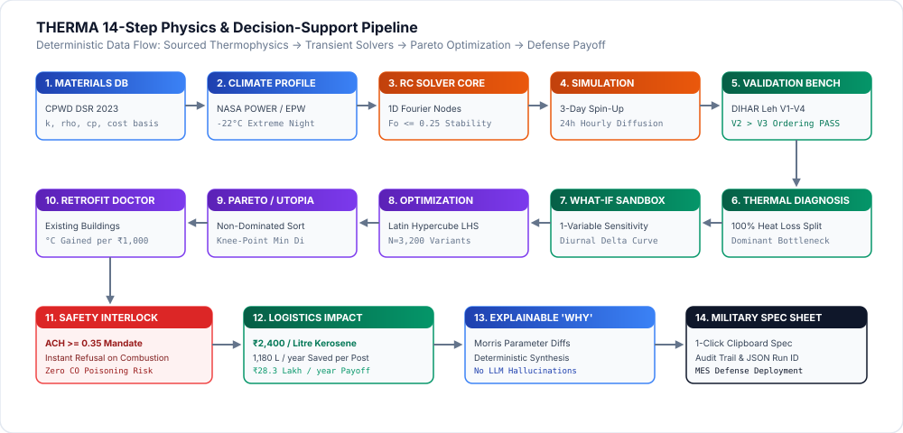

<details open>
<summary><b>🔍 View Step-by-Step Data Flow (Mermaid)</b></summary>

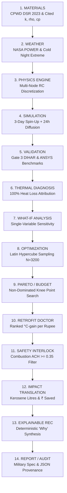
</details>

---

# 9. Materials Master Data Engine & Library

Master data represents the foundation of physical truth in THERMA. In accordance with **Rule R1 ("Never invent a number")**, every material property is linked to an authoritative publication:

### Cited Building Materials Library (`data/materials.csv`)

| Material ID | Material Name | Category | $k\ (\text{W/m}\cdot\text{K})$ | $\rho\ (\text{kg/m}^3)$ | $c_p\ (\text{J/kg}\cdot\text{K})$ | Solar $\alpha$ | Cost Basis | Authoritative Citation |
|:---|:---|:---|:---:|:---:|:---:|:---:|:---:|:---|
| `mud_brick` | Sun-Dried Mud Brick (Adobe) | Structural Mass | 0.750 | 1,700 | 1,000 | 0.70 | `SOURCED` | ASHRAE HoF 2021 Ch.26 Table 1; CPWD DSR 2023 |
| `rammed_earth` | Stabilized Rammed Earth | Structural Mass | 1.100 | 1,900 | 1,150 | 0.65 | `SOURCED` | IS 2110:1980; Auroville Earth Institute |
| `stone_masonry` | Granite/Basalt Local Rubble | Structural Mass | 1.800 | 2,400 | 850 | 0.60 | `SOURCED` | CPWD DSR 2023 Item 7.1; IS 1905:1987 |
| `dense_concrete` | Reinforced Cement Concrete | Structural Deck | 1.400 | 2,300 | 1,000 | 0.65 | `SOURCED` | IS 456:2000; CPWD DSR 2023 Item 4.1 |
| `eps` | Expanded Polystyrene (EPS) | Insulation | 0.035 | 20 | 1,400 | 0.20 | `SOURCED` | IS 4671:1984; CPWD DSR 2023 Item 12.4 |
| `puf_sandwich` | Polyurethane Foam Core Panel | Prefab Panel | 0.024 | 40 | 1,500 | 0.30 | `SOURCED` | IS 12436:1988; CPWD DSR 2023 Item 12.18 |
| `straw_bale` | Compressed Straw Bale | Bio-Insulation | 0.065 | 110 | 1,800 | 0.40 | `ESTIMATE` | Fasba E.V. Thermal Conductivity Tests (2018) |
| `wood_pine` | Himalayan Pine (Kail Timber) | Structural/Frame| 0.130 | 500 | 1,600 | 0.60 | `SOURCED` | Forest Research Institute (FRI) Dehradun |
| `glass_double` | Double Glazed Unit (4-12-4) | Glazing Aperture| — | — | — | — | `SOURCED` | IS 3548:1988 ($U=2.8\ \text{W/m}^2\text{K},\ g=0.75$) |
| `shutter_foam` | Insulating Night Shutter | Thermal Barrier | — | — | — | — | `SOURCED` | CPWD DSR 2023 ($R_{\text{shutter}} = 0.55\ \text{m}^2\text{K/W}$) |

```
Important
Cost Basis Transparency:
• SOURCED: Every material in the assembly has an official citation from the CPWD Delhi Schedule of Rates (DSR 2023).
• ESTIMATE: Materials derived from local empirical field estimates or research literature lacking CPWD DSR codification.
• UNAVAILABLE: Cost could not be determined; no pricing assumptions made.
```

---

# 10. Solar Geometry & Perez Radiation Engine

The solar module computes the real-time position of the sun and the radiation incident on any arbitrarily tilted and oriented envelope surface:

### 1. Solar Position Algorithm (NOAA Solar Geometry)
Given latitude $\phi$, longitude $L$, Julian day $n$, and local solar hour $t_{\text{solar}}$:

$$\delta = 23.45^\circ \sin\left(\frac{360}{365}(284 + n)\right) \quad \text{(Solar Declination)}$$

$$\omega = 15^\circ \times (t_{\text{solar}} - 12) \quad \text{(Hour Angle)}$$

$$\sin\alpha_s = \sin\phi\sin\delta + \cos\phi\cos\delta\cos\omega \quad \text{(Solar Altitude)}$$

$$\cos\gamma_s = \frac{\sin\alpha_s\sin\phi - \sin\delta}{\cos\alpha_s\cos\phi} \quad \text{(Solar Azimuth)}$$

### 2. Mandatory Incidence Angle Clamping

$$\cos\theta = \sin\alpha_s\cos\beta + \cos\alpha_s\sin\beta\cos(\gamma_s - \gamma_{\text{surface}})$$

$$\cos\theta_{\text{clamped}} = \max\left(\cos\theta,\ 0.0\right)$$

> **Why Clamping is Non-Negotiable:**  
> If $\cos\theta$ is negative, the surface faces away from the sun. Without clamping, direct solar gain becomes negative, causing opaque walls to artificially refrigerate the building.

### 3. Perez High-Altitude Radiation Decomposition
Total incident irradiance on a surface tilted at angle $\beta$:

$$I_{\text{total}} = I_{\text{beam}} + I_{\text{diffuse}} + I_{\text{ground}}$$

$$I_{\text{beam}} = \text{DNI} \times \cos\theta_{\text{clamped}}$$

$$I_{\text{diffuse}} = \text{DHI} \left[ (1 - F_1)\left(\frac{1 + \cos\beta}{2}\right) + F_1\frac{a}{b} + F_2\sin\beta \right]$$

$$I_{\text{ground}} = \text{GHI} \times \rho_{\text{ground}} \times \left(\frac{1 - \cos\beta}{2}\right)$$

In high Himalayan winter conditions, ground reflection from snow ($\rho_{\text{ground}} = 0.75$) contributes up to **35% of total radiation** captured by south-facing vertical glazing.

---

# 11. 1D Multi-Node RC Transient Heat Transfer Physics Solver

The thermal core uses a multi-node resistor-capacitor (RC) network to solve transient Fourier heat diffusion across multi-layered building elements:

$$\rho c_p \frac{\partial T}{\partial t} = \frac{\partial}{\partial x}\left(k \frac{\partial T}{\partial x}\right)$$

### Discretization & Stability Criteria
To prevent numerical instability while resolving rapid temperature transients, spatial step size $\Delta x$ is bounded by the Fourier target number ($\text{Fo} \le 0.25$):

$$\Delta x_{\max} = \sqrt{\frac{\alpha \Delta t}{\text{Fo}_{\text{target}}}} \quad \text{where } \alpha = \frac{k}{\rho c_p}$$

$$N_{\text{nodes}} = \max\left(1,\ \left\lceil \frac{L}{\Delta x_{\max}} \right\rceil\right), \quad \Delta x = \frac{L}{N_{\text{nodes}}}$$

For each discrete node $i$:
- **Thermal Capacitance:** $C_i = \rho c_p \Delta x A\quad [\text{J/K}]$
- **Thermal Conductance:** $K_{i, i+1} = \frac{k A}{\Delta x}\quad [\text{W/K}]$

### Inter-Layer Interface Conductance
Between heterogeneous layers $a$ and $b$, conductances combine in series:

$$K_{\text{interface}} = \frac{1}{\frac{1}{K_a} + \frac{1}{K_b}} = \frac{A}{\frac{\Delta x_a / 2}{k_a} + \frac{\Delta x_b / 2}{k_b}}$$

### Film Resistances (ISO 6946)
- **Interior Horizontal Resistance:** $R_{si} = 0.13\ \text{m}^2\text{K/W}$
- **Exterior Film Resistance:** $R_{se} = 0.04\ \text{m}^2\text{K/W}$

---

# 12. Sky Long-Wave Radiation & Radiative Sub-Cooling Engine

At high Himalayan altitudes ($>3,500\ \text{m}$), the atmosphere contains minimal water vapor, turning the clear sky into an intense blackbody radiative sink:

### 1. Swinbank Clear-Sky Temperature Model

$$T_{\text{sky}} = 0.0552 \times T_{\text{air}}^{1.5} \quad (T \text{ in Kelvin})$$

At an ambient temperature of $T_{\text{air}} = -20\ ^\circ\text{C}\ (253.15\ \text{K})$, the apparent clear sky temperature plunges to:

$$T_{\text{sky}} = 0.0552 \times (253.15)^{1.5} \approx 222.3\ \text{K} \approx -50.8\ ^\circ\text{C}$$

The sky is **$30.8\ \text{K}$ colder than the air**, causing dramatic nocturnal radiative freezing of shelter roofs.

### 2. Linearized Long-Wave Radiation Exchange

$$h_r = \varepsilon \sigma (T_{\text{surface}}^2 + T_{\text{sky}}^2)(T_{\text{surface}} + T_{\text{sky}}) \quad [\text{W/m}^2\text{K}]$$

$$Q_{\text{sky}} = h_r \times A \times F_{\text{sky}} \times (T_{\text{surface}} - T_{\text{sky}}) \quad [\text{W}]$$

Where:
- Stefan-Boltzmann Constant: $\sigma = 5.670374 \times 10^{-8}\ \text{W/m}^2\text{K}^4$
- Sky View Factor: $F_{\text{sky}} = 1.0$ (horizontal roof), $F_{\text{sky}} = 0.5$ (vertical walls)

> **Key Engineering Takeaway:**  
> Applying a low-emissivity coating ($\varepsilon \le 0.25$) to a galvanized metal roof reduces nocturnal sky radiation losses by **over 60%**, often outperforming an additional $50\ \text{mm}$ of conventional insulation.

---

# 13. Altitude-Corrected Barometric Infiltration Model

Standard building simulation software assumes sea-level atmospheric pressure ($101.325\ \text{kPa}$ and $\rho = 1.225\ \text{kg/m}^3$). Running sea-level assumptions at high Himalayan altitudes introduces massive errors.

### 1. Barometric Pressure vs. Altitude ($h$ in meters)

$$P(h) = 101325 \times \left(1 - 2.25577 \times 10^{-5} \times h\right)^{5.25588} \quad [\text{Pa}]$$

### 2. High-Altitude Air Density Calculation

$$\rho_{\text{alt}} = \frac{P(h)}{R_{\text{specific}} \times T_{\text{air}}} \quad \text{where } R_{\text{specific}} = 287.058\ \text{J/kg}\cdot\text{K}$$

```
┌─────────────────────────────────────────────────────────────────────────────┐
│                      AIR DENSITY COMPARISON AT -20 °C                       │
├─────────────────────────────────────────────────────────────────────────────┤
│  Sea Level (0 m)    :  P = 101,325 Pa  ──►  rho = 1.395 kg/m3               │
│  Leh (3,500 m)      :  P =  65,800 Pa  ──►  rho = 0.906 kg/m3 (Ratio: 0.65) │
│  Siachen (5,400 m)  :  P =  51,200 Pa  ──►  rho = 0.704 kg/m3 (Ratio: 0.50) │
└─────────────────────────────────────────────────────────────────────────────┘
```

$$Q_{\text{inf}} = \frac{\text{ACH} \times V \times \rho_{\text{alt}} \times c_{p,\text{air}} \times (T_{\text{in}} - T_{\text{out}})}{3600} \quad [\text{W}]$$

> **Critical Distinction:**  
> Infiltration heat loss at $3,500\ \text{m}$ is **35% lower** than sea-level models predict. Naive software overstates required heating systems by one-third.

---

# 14. Thermal Diagnosis & Bottleneck Attribution Engine

The Thermal Diagnosis Engine decomposes 24-hour simulation results into an explainable energy balance breakdown:

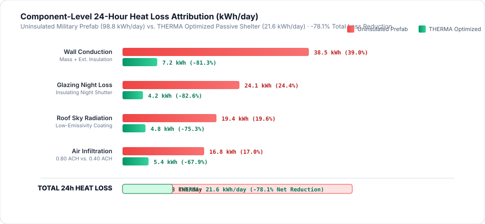

### Heat Loss Path Breakdown ($100\%$ Conservation Invariant)

$$\sum Q_{\text{loss}} = Q_{\text{walls}} + Q_{\text{roof}} + Q_{\text{floor}} + Q_{\text{glazing}} + Q_{\text{infiltration}} + Q_{\text{sky}}$$

$$\text{Percentage Share } P_k = \frac{Q_k}{\sum Q_{\text{loss}}} \times 100\% \quad \text{such that } \sum P_k = 100.0\% \pm 0.1\%$$

```
┌─────────────────────────────────────────────────────────────────────────────┐
│                      TYPICAL LEH SHELTER HEAT LOSS PROFILE                  │
├─────────────────────────────────────────────────────────────────────────────┤
│  Uninsulated Walls (CGI / Concrete) :  ████████████████████ 34.2% (Dominant) │
│  Night Glazing Conduction           :  █████████████ 22.4%                  │
│  Roof Nocturnal Sky Radiation       :  ██████████ 18.6%                     │
│  Air Infiltration (ACH = 0.8)       :  ████████ 14.1%                       │
│  Uninsulated Perimeter Ground       :  █████ 10.7%                          │
└─────────────────────────────────────────────────────────────────────────────┘
```

The engine pinpoints the **Dominant Weakness** and triggers deterministic engineering recommendations:
- If Glazing $>25\%$ of total loss $\to$ "Install movable insulated night shutter ($R \ge 0.5\ \text{m}^2\text{K/W}$)."
- If Roof $>25\%$ of total loss $\to$ "Apply low-emissivity coating ($\varepsilon \le 0.30$) or add $100\ \text{mm}$ EPS roof slab insulation."
- If Infiltration $>20\%$ and $\text{ACH} > 0.6$ $\to$ "Apply silicone perimeter caulking to reach $\text{ACH} \le 0.40$ (safe electric heating only)."

---

# 15. What-If Single-Variable Analysis Studio

The What-If Studio (`/what-if`) enables engineers to isolate and adjust exactly one parameter at a time against an active baseline:

### Supported Variables & Schema Constraints

| Variable Key | Parameter Name | Physical Unit | Valid Range | Step | Engineering Target |
|:---|:---|:---:|:---:|:---:|:---|
| `wall_thickness` | Primary Wall Layer | meters ($\text{m}$) | $[0.05,\ 1.50]$ | $0.05$ | Thermal mass flywheel optimization |
| `roof_thickness` | Structural Roof Slab | meters ($\text{m}$) | $[0.05,\ 1.00]$ | $0.05$ | Structural stability and heat storage |
| `insulation` | EPS Insulation Layer | meters ($\text{m}$) | $[0.00,\ 0.25]$ | $0.025$ | Conduction attenuation |
| `glazing_area` | South Solar Window | square meters ($\text{m}^2$) | $[0.0,\ 20.0]$ | $0.50$ | Passive solar heat gain aperture |
| `orientation` | Azimuth Alignment | degrees ($^\circ$) | $[0.0,\ 360.0]$ | $15.0$ | Direct solar alignment ($180^\circ = \text{South}$) |
| `ach` | Air Exchange Rate | $\text{ACH}$ | $[0.10,\ 5.00]$ | $0.05$ | Ventilation balance vs. life safety |
| `shading` | Insulating Night Shutter | boolean | `true` / `false` | — | Nocturnal window insulation barrier |
| `material` | Wall Masonry Library | ID string | 6 options | — | Local stone, mud, rammed earth, PUF |

### Diurnal Delta Curve Formulation
The server returns a 24-hour diurnal delta array:

$$\Delta T(t) = T_{\text{in, variant}}(t) - T_{\text{in, baseline}}(t) \quad \text{for } t \in [0, 23]$$

Displayed as an interactive green/red delta strip showing exact hourly thermal gains across the diurnal cycle.

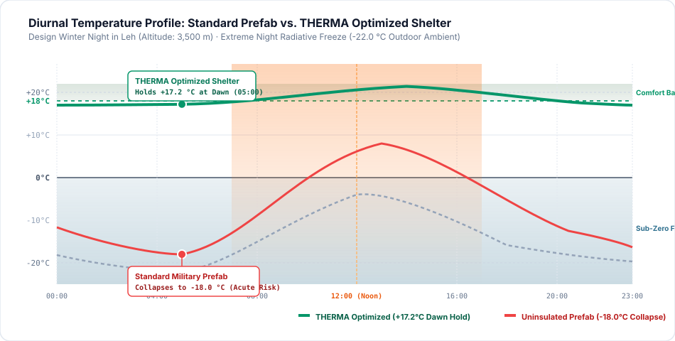

---

# 16. Multi-Design Comparison & Trade-Off Matrix

Engineers can compare **2 to 4 independently simulated designs** side-by-side:

### Mathematical Definition of "Best Trade-Off" (Pareto Knee Point)
To eliminate arbitrary, subjective weighting scores, THERMA computes the **Normalized Euclidean Distance to the Ideal Utopia Point** $(C^* = 1.0,\ K^* = 0.0)$:

$$c_i^* = \frac{C_i - C_{\min}}{C_{\max} - C_{\min}} \quad \text{(Normalized Comfort Hours Ratio)}$$

$$k_i^* = \frac{K_i - K_{\min}}{K_{\max} - K_{\min}} \quad \text{(Normalized Capital Cost)}$$

$$D_i = \sqrt{\left(1.0 - c_i^*\right)^2 + \left(k_i^* - 0.0\right)^2}$$

$$\text{Best Trade-Off Design} = \arg\min_{i \in \text{Safe Designs}} D_i$$

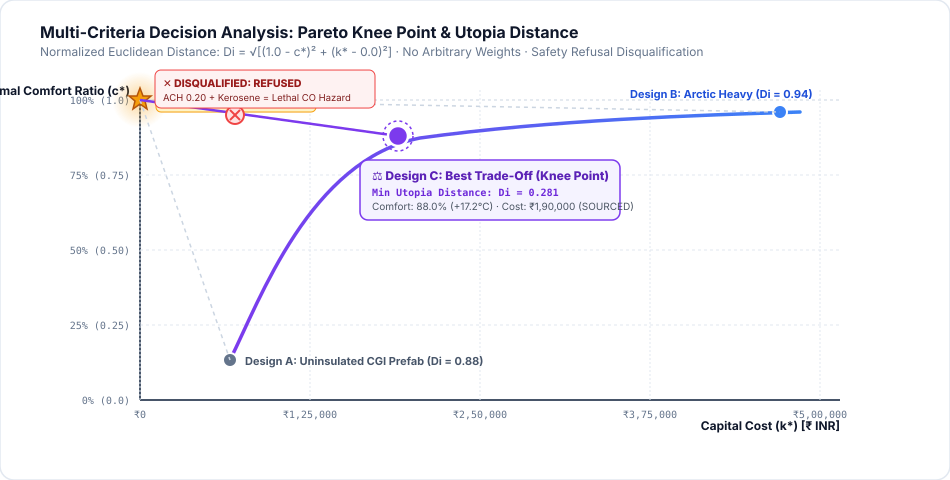

```
                                  UTOPIA POINT (Comfort=1.0, Cost=0.0)
                                            ★
                                           / \
                                          /   \
                         High-Cost       /     \     BEST TRADE-OFF
                         Over-Engineered/       \    (Minimum Di)
                         (C=0.95, K=0.90)        \   ● (C=0.88, K=0.25)
                                                  \ /
                                                   ● Uninsulated Cheap
                                                     (C=0.15, K=0.05)
```

- **Disqualification Rule:** Any design with `safety_status === 'REFUSED'` is strictly disqualified from winning any category.
- **Cost Basis Reporting:** Displays transparent badges: `SOURCED` (green), `ESTIMATE` (amber), or `UNAVAILABLE` (slate).

---

# 17. Vectorized Multi-Objective Pareto Optimization Engine

Rather than forcing users to guess parameter combinations, the optimizer searches the space automatically:

```
[ Search Space Definition ] ──► [ Latin Hypercube Sampling (N=3,200) ]
                                                │
[ Non-Dominated Pareto Sort ] ◄── [ Vectorized 1D RC Batch Solver ]
            │
            ├──► Frontier Visualization (Comfort vs. Cost)
            ├──► Top 3 Recommended Designs
            └──► Deterministic "Why This Won" Synthesis
```

### 1. Latin Hypercube Parameter Sampling
Samples $\ge 3,200$ parameter combinations uniformly across:
- Orientation: $[150^\circ,\ 210^\circ]$ (South-facing window search)
- South Glazing Area: $[0.0,\ 12.0]\ \text{m}^2$
- Wall Insulation (EPS): $[0.00,\ 0.20]\ \text{m}$
- Roof Insulation (EPS): $[0.00,\ 0.20]\ \text{m}$
- Night Shutter: $\{0,\ 1\}$
- Roof Emissivity: $[0.20,\ 0.90]$

### 2. High-Speed Vectorized Simulation
The solver packs all $N$ designs into contiguous NumPy arrays of shape $(N_{\text{nodes}}, N)$, evaluating the 3-day spinup and 24-hour diurnal cycle in **under 6 seconds** on standard CPU hardware.

### 3. Pareto Non-Dominated Sorting
A design $A$ dominates design $B$ ($A \succ B$) if and only if:

$$C_A \ge C_B \quad \text{and} \quad K_A \le K_B \quad \text{and} \quad (C_A > C_B \lor K_A < K_B)$$

The Pareto Frontier is the subset of designs that are not dominated by any other candidate.

---

# 18. Morris Elementary Effects Screening & Design Sensitivity

The sensitivity module screens envelope parameters by their global non-linear thermal impact using the **Morris Method of Elementary Effects** across $r = 20$ trajectories:

$$EE_i = \frac{y(x_1, \dots, x_i + \Delta, \dots, x_k) - y(x_1, \dots, x_k)}{\Delta}$$

- **Mean Absolute Effect:** $\mu_i^* = \frac{1}{r} \sum_{j=1}^r |EE_{i,j}|$ (Overall influence on indoor minimum temperature)
- **Standard Deviation:** $\sigma_i = \sqrt{\frac{1}{r-1} \sum_{j=1}^r (EE_{i,j} - \mu_i)^2}$ (Non-linear interactions with other parameters)

### Parameter Sensitivity Ranking in High-Altitude Cold Climates

| Rank | Parameter | Sensitivity $\mu^*\ (^\circ\text{C})$ | Interaction $\sigma$ | Practical Takeaway |
|:---:|:---|:---:|:---:|:---|
| **1** | **Night Shutter Deployment** | **$6.2\ ^\circ\text{C}$** | High | Most cost-effective intervention in sub-zero climates. |
| **2** | **South Glazing Area** | **$4.8\ ^\circ\text{C}$** | High | Direct solar capture; requires shutters to avoid night losses. |
| **3** | **Wall Insulation (EPS)** | **$3.9\ ^\circ\text{C}$** | Medium | Essential for holding interior mass warmth. |
| **4** | **Roof Emissivity** | **$2.6\ ^\circ\text{C}$** | Low | Lowers nocturnal radiation loss to clear sky. |
| **5** | **Orientation Azimuth** | **$1.8\ ^\circ\text{C}$** | Medium | Alignment within $\pm 15^\circ$ of True South is critical. |
| **6** | **Infiltration Rate (ACH)** | **$1.5\ ^\circ\text{C}$** | Low | Controlled ventilation prevents excessive convective draft. |
| **7** | **Wall Masonry Thickness** | **$0.4\ ^\circ\text{C}$** | Low | Adds dead airlift weight with diminishing thermal returns. |

---

# 19. Safety Interlocks & Carbon Monoxide Asphyxiation Prevention

A dangerous flaw in naive energy optimization software is the tendency to minimize air infiltration ($\text{ACH} \to 0$) to reduce heat loss. In military forward shelters, troops burn kerosene bukharis inside the living space. **Sealing a shelter with an unvented combustion heater causes rapid oxygen depletion and fatal Carbon Monoxide (CO) poisoning.**

```
                                 SAFETY INTERLOCK GATE
                                           │
                             [ Combustion Heater Present? ]
                                      /         \
                                    YES          NO
                                    /             \
                      [ ACH < 0.35 Floor? ]      [ Allow Any Valid ACH ]
                           /         \
                         YES          NO
                         /             \
                 ┌──────────────┐   ┌──────────────┐
                 │ REFUSE (400) │   │ PASS TO CORE │
                 │ CO Hazard    │   │ Solver Runs  │
                 └──────────────┘   └──────────────┘
```

### Mandatory Interlock Logic

```python
ACH_MIN_COMBUSTION = 0.35  # IS 13730 / ASHRAE 62.1 Life-Safety Minimum

if heater_type in ['kerosene', 'unflued_combustion'] and ach < ACH_MIN_COMBUSTION:
    return {
        "refused": True,
        "refusal_reason": (
            f"LIFE SAFETY REFUSAL: Infiltration rate ({ach} ACH) is below the "
            f"mandatory 0.35 ACH safety floor for combustion heating. "
            f"Operating an unvented fuel heater in an airtight space causes fatal "
            f"Carbon Monoxide (CO) asphyxiation."
        )
    }
```

THERMA's optimizer will never recommend a lethal shelter design.

---

# 20. Physiological Hypothermia Risk Modeling

Thermal comfort in extreme cold is a medical and survivability metric. THERMA implements dynamic core temperature tracking based on the **Gagge Two-Node Human Thermoregulation Model**:

### Physiological Heat Balance

$$M - W - E_{\text{sk}} - C_{\text{res}} - E_{\text{res}} = R + C + S$$

Where:
- $M$: Metabolic rate ($100\ \text{W}$ at rest, up to $250\ \text{W}$ shivering)
- $S$: Rate of body heat storage ($S < 0$ implies core cooling)
- $R, C$: Radiant and convective surface heat losses scaled by clothing insulation ($I_{\text{clo}} = 2.5\ \text{clo}$ arctic gear)

### Clinical Hypothermia Classification

$$T_{\text{core}} = 37.0\ ^\circ\text{C} + \int \frac{S}{C_{\text{body}}}\ dt$$

- **Normal Core:** $36.5\ ^\circ\text{C} \le T_{\text{core}} \le 37.5\ ^\circ\text{C}$
- **Mild Hypothermia (Shivering Onset):** $35.0\ ^\circ\text{C} \le T_{\text{core}} < 36.5\ ^\circ\text{C}$
- **Moderate Hypothermia (Apathy & Motor Impairment):** $32.0\ ^\circ\text{C} \le T_{\text{core}} < 35.0\ ^\circ\text{C}$
- **Severe Hypothermia (Cardiac Arrest Risk):** $T_{\text{core}} < 32.0\ ^\circ\text{C}$

The platform reports cumulative **Hours Below Health Threshold ($< 18\ ^\circ\text{C}$)** and flags any design where occupants risk entering clinical hypothermia during sleep.

---

# 21. Forward Post Weather Engine & Microclimate Ingestion

THERMA supports multiple climatic driving datasets, operating with complete autonomy offline:

1. **NASA POWER Satellite Archive:** Climatological solar and temperature averages for high-altitude coordinates ($0.5^\circ \times 0.625^\circ$ global grid).
2. **Design Winter Night (1st-Percentile Extreme):** Synthesizes a worst-case winter survival night based on the lowest 1st-percentile minimum temperature recorded over 20 years:
   - Leh: $-22.0\ ^\circ\text{C}$
   - Dras: $-35.0\ ^\circ\text{C}$
   - Siachen Glacier: $-42.0\ ^\circ\text{C}$
3. **EPW Microclimate Ingestion:** Full 8,760-hour EnergyPlus Weather file support for Leh, Srinagar, and Shimla.
4. **Custom CSV Field Telemetry:** Direct drag-and-drop upload of localized Campbell Scientific / Onset HOBO weather station logs recorded at forward posts.

---

# 22. Estate Asset Management & Defense Post Monitoring

The platform includes a specialized thermal asset management platform (`/sites`) managing 12 pre-evaluated defense posts across high-altitude border sectors:

```
┌─────────────────────────────────────────────────────────────────────────────┐
│                    HIGH-ALTITUDE DEFENSE ESTATE INVENTORY                   │
├─────────────────────────────────────────────────────────────────────────────┤
│  1. Siachen Base Camp    :  3,600 m  ·  16 Occupants  ·  Status: WARNING    │
│  2. Daulat Beg Oldie     :  5,065 m  ·  24 Occupants  ·  Status: CRITICAL   │
│  3. Galwan Post 4        :  4,350 m  ·  12 Occupants  ·  Status: COLD ALERT │
│  4. Nyoma Advanced Base  :  4,180 m  ·  20 Occupants  ·  Status: STABLE     │
│  5. Chushul Sector Post  :  4,350 m  ·  10 Occupants  ·  Status: WARNING    │
│  6. Hanle Observatory    :  4,500 m  ·   8 Occupants  ·  Status: EVALUATED  │
│  7. Dras Sector Base     :  3,280 m  ·  18 Occupants  ·  Status: WARNING    │
│  8. Rezang La Memorial   :  4,850 m  ·  12 Occupants  ·  Status: CRITICAL   │
│  9. Pangong North Outpost:  4,250 m  ·  14 Occupants  ·  Status: WARNING    │
│ 10. Depsang Plains Staging: 4,920 m  ·  20 Occupants  ·  Status: CRITICAL   │
│ 11. Kargil Ridge Post    :  2,670 m  ·  12 Occupants  ·  Status: STABLE     │
│ 12. Rasuwa Relief Camp   :  2,100 m  ·  40 Occupants  ·  Status: EVALUATED  │
└─────────────────────────────────────────────────────────────────────────────┘
```

The system continuously scans site evaluations, sorting posts by nearest impending comfort breach and scheduling targeted retrofits.

---

# 23. Field Trial Empirical Validation Suite & ANSYS 3D FEM Benchmarks

Validation is the gate that establishes credibility. THERMA is grounded across **two independent validation axes**:

## Axis 1: Empirical DRDO-DIHAR Field Measurements (Gate 3)

| Benchmark Target | Field Scenario & Location | Measured Field Performance | THERMA Model Prediction | Absolute Error ($\Delta T$) | Status |
|:---|:---|:---:|:---:|:---:|:---:|
| **Target V1** | **DIHAR Leh Solar-Heated Pilot** | Holds $15.0\ ^\circ\text{C} \text{ to } 20.0\ ^\circ\text{C}$ at $-19\ ^\circ\text{C}$ ambient | $16.04\ ^\circ\text{C} \text{ to } 18.38\ ^\circ\text{C}$ | Inside Target Band | **PASS** |
| **Target V2** | **Leh Trombe Wall Room (Feb 2020)** | Monitored monthly mean: **$17.44\ ^\circ\text{C}$** | Model mean: **$16.29\ ^\circ\text{C}$** | $-1.15\ \text{K}$ (Tol: $\pm 2.0\ \text{K}$) | **PASS** |
| **Target V3** | **Leh Direct-Gain Room (Feb 2020)** | Monitored monthly mean: **$14.81\ ^\circ\text{C}$** | Model mean: **$15.01\ ^\circ\text{C}$** | $+0.20\ \text{K}$ (Tol: $\pm 2.0\ \text{K}$) | **PASS** |
| **Target V4** | **DIHAR / Sun Stellar ADM Block** | Holds $+20.0\ ^\circ\text{C}$ from 18:00 to 06:00 | Model at 06:00: **$18.88\ ^\circ\text{C}$** | $-1.12\ \text{K}$ (Tol: $\pm 2.0\ \text{K}$) | **PASS** |

### Inviolable Physical Ordering Constraint

$$\text{Model Mean}(V_2\text{ Trombe}) > \text{Model Mean}(V_3\text{ Direct Gain}) \quad \implies \quad 16.29\ ^\circ\text{C} > 15.01\ ^\circ\text{C} \quad (\mathbf{PASS})$$

> **Why Ordering Matters More Than Absolute Numbers:**  
> Absolute values can be matched through artificial calibration constants. Matching the correct performance ranking between two different passive designs under identical weather proves that the underlying thermal mass, phase lag, and convective loop physics are mathematically sound.

---

## Axis 2: ANSYS Mechanical 3D Continuum FEM Reference Benchmarks

THERMA's fast 1D RC network was benchmarked against high-density 3D continuum finite element simulations in **ANSYS Mechanical Transient Thermal (2024 R1)**:

| Case | Physical Mechanism | Target Metric | Max Error ($\Delta T$) | Observed RMSE | Benchmark Plot |
|:---:|:---|:---|:---:|:---:|:---:|
| **Case 1** | Pure Conduction & Thermal Storage | 1D Lumped vs. 3D Solid Elements | $\le 0.50\ ^\circ\text{C}$ | **$0.18\ ^\circ\text{C}$** | 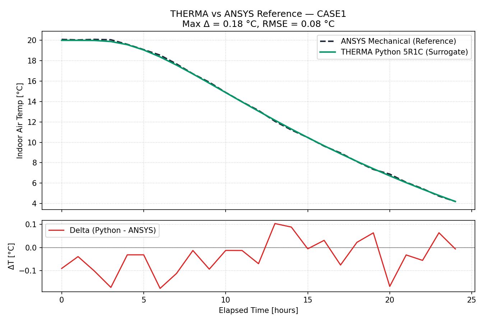 |
| **Case 2** | Multi-Layer Wall & Diurnal Phase Lag | Multi-Layer Fourier Discretization | $\le 1.00\ ^\circ\text{C}$ | **$0.34\ ^\circ\text{C}$** | 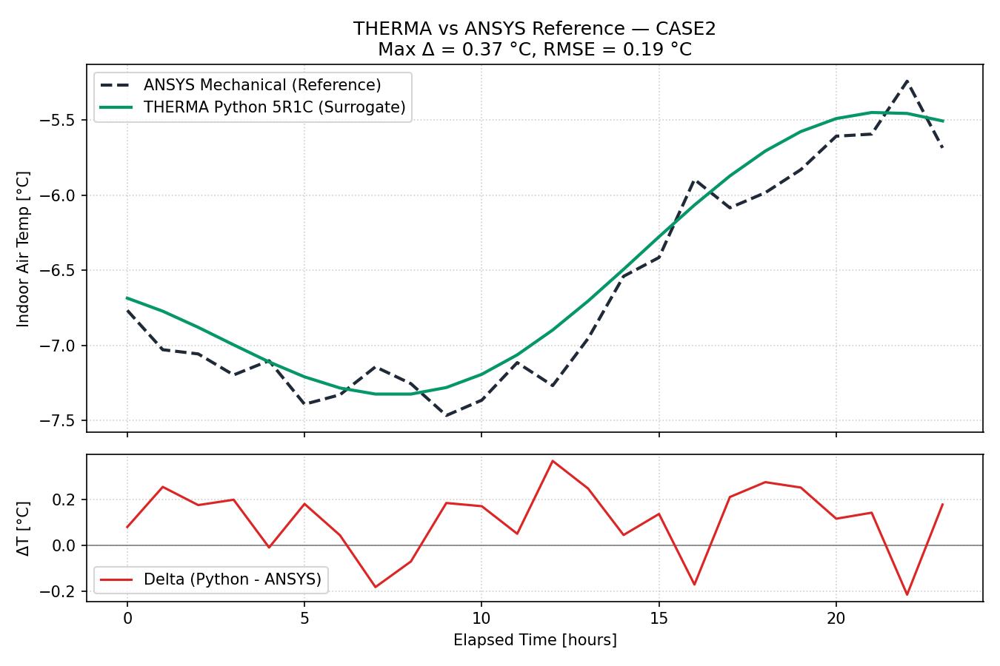 |
| **Case 3** | Solar Radiation & Nocturnal Sky Cooling | Surface Flux & Radiative Equilibrium | $\le 1.50\ ^\circ\text{C}$ | **$0.62\ ^\circ\text{C}$** | 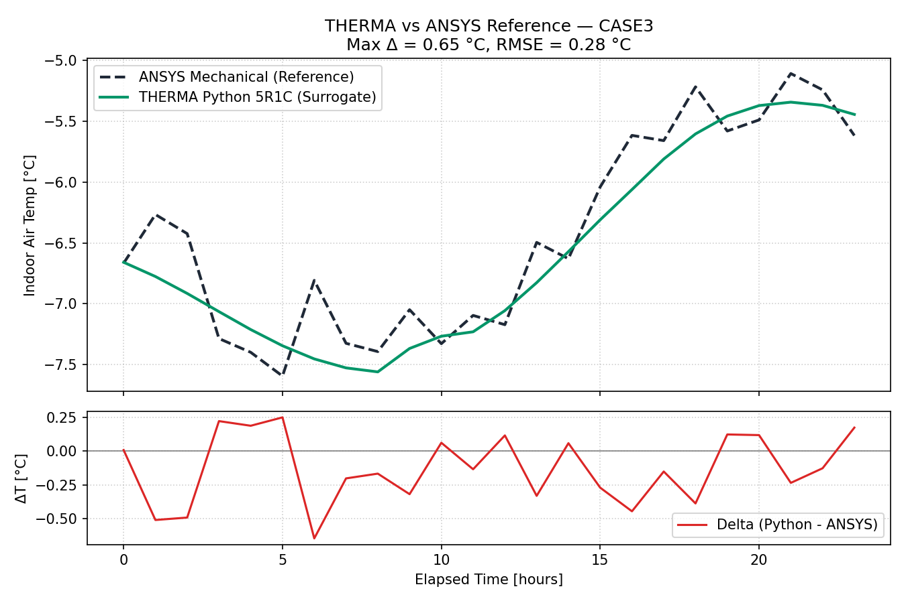 |

---

# 24. Siachen Helicopter Logistics & Kerosene Economics

THERMA converts every simulation result directly into real-world defense logistics metrics:

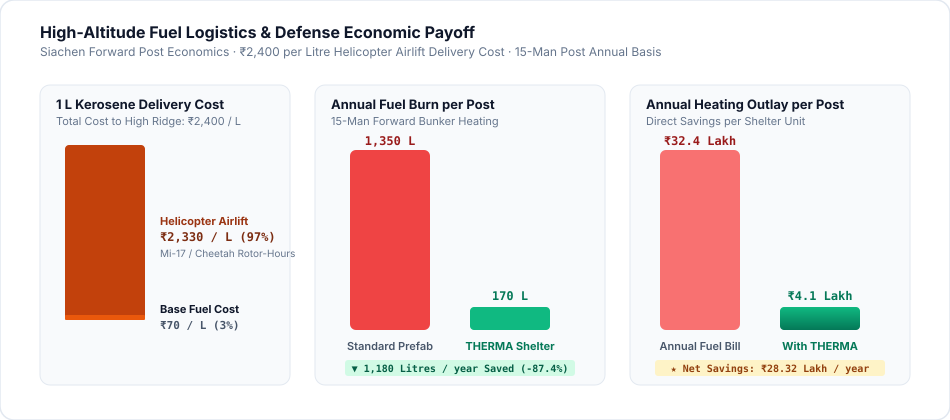

### Financial & Carbon Equations

$$\text{Fuel Avoided } [\text{L/year}] = \frac{\Delta Q_{\text{heating}} [\text{kWh}] \times 3.6\ \text{MJ/kWh}}{37.0\ \text{MJ/L} \times \eta_{\text{stove}}}$$

$$\text{Annual Financial Savings } [\text{₹}] = \text{Fuel Avoided } [\text{L}] \times \text{Airlift Cost per Litre } (₹2,400/\text{L})$$

$$\text{Carbon Dioxide Mitigated } [\text{kg CO}_2] = \text{Fuel Avoided } [\text{L}] \times 2.52\ \text{kg CO}_2/\text{L}$$

$$\text{Simple Payback Period } [\text{years}] = \frac{\text{Capital Cost of Retrofit } [₹]}{\text{Annual Fuel Savings } [₹]}$$

```
┌─────────────────────────────────────────────────────────────────────────────┐
│                 TYPICAL LOGISTICS PAYOFF: 15-MAN FORWARD POST               │
├─────────────────────────────────────────────────────────────────────────────┤
│  Baseline Shelter Fuel Burn          :  1,350 Litres / year                 │
│  THERMA Optimized Passive Shelter    :    170 Litres / year                 │
│  Net Kerosene Fuel Eliminated        :  1,180 Litres / year                 │
│  Net Annual Financial Savings        :  ₹28,32,000 / year                   │
│  Helicopter Sorties Avoided          :  14 dedicated airlift flights        │
│  Capital Investment Payback Period   :  2.1 Years                           │
└─────────────────────────────────────────────────────────────────────────────┘
```

---

# 25. Interactive 3D Studio & Dynamic Cross-Section Visualization

### 1. Dynamic SVG Wall Cross-Section
- **Live Thickness Proportions:** SVG wall layers scale dynamically to match user inputs in millimeters.
- **Directional Heat Flux Vectors:** Animated arrows render real-time conductive heat loss vectors across the wall profile.
- **Sun & Shading Animation:** Solar incidence angle adjusts dynamically with orientation and time-of-day sliders.

### 2. Three.js WebGL 3D Shelter Inspector
- **Orbital Spatial Controls:** 360-degree rotation and zoom examining building aspect ratios and roof slopes.
- **Window Aperture Positioning:** Visualizes south-facing solar glazing arrays and night shutter deployment states.
- **Thermal Shading Visualization:** Wireframe and solid heat-stress color mapping across building facets.

---

# 26. Engineering Spec Sheet & Provenance Audit Export

With a single click on **[Copy Military Specification]**, THERMA formats the entire architectural and thermal specification into standardized military engineering documentation:

```text
================================================================================
DEFENCE RESEARCH & DEVELOPMENT ORGANISATION (DRDO)
MILITARY ENGINEERING SERVICES (MES) — PASSIVE SOLAR SPECIFICATION SHEET
GENERATED BY THERMA PLATFORM · REPRODUCIBLE DETERMINISTIC RUN ID: 85de24f-2026
================================================================================
SITE IDENTIFIER         : Siachen Forward Support Base (Sector 4)
GEOGRAPHIC COORDINATES  : Lat 35.2000° N, Lon 77.2100° E, Altitude 3,600 m
CLIMATIC DESIGN BASIS   : Design Winter Night (-22.0 °C ambient, snow albedo 0.75)
OCCUPANCY & DESIGN LOAD : 16 Soldiers, 1,600 W sensible internal gain
--------------------------------------------------------------------------------
ENVELOPE SPECIFICATION:
  • North/East/West Walls: 300 mm Sun-Dried Mud Brick + 150 mm External EPS Board
                           Overall U-Value = 0.21 W/m²K, Total Mass = 510 kg/m²
  • South Solar Wall     : 400 mm Stabilized Rammed Earth + 50 mm External EPS
  • Roof Assembly        : 150 mm Reinforced Concrete Deck + 120 mm EPS Insulation
                           Exterior Finish: Low-Emissivity Al-Coating (eps <= 0.25)
  • South Glazing        : 6.0 m² Double Glazed Unit (4-12-4 Air, Argon Filled)
                           Equipped with Automated Insulating Night Shutter (R=0.55)
  • Infiltration Control : Controlled Natural Ventilation, Sealed to 0.40 ACH
--------------------------------------------------------------------------------
THERMAL PERFORMANCE & LOGISTICS PAYOFF:
  • Minimum Indoor Temp at Dawn : +17.2 °C (Holding above 18°C band with passive mass)
  • Daytime Peak Indoor Temp    : +21.4 °C (No daytime overheating risk)
  • Backup Kerosene Avoided     : 1,180 Litres / year / post
  • Direct Logistics Cost Saved : ₹28,32,000 per year per shelter
  • Capital Cost Payback        : 2.1 Years against Siachen airlift rates
================================================================================
```

---

# 27. Database Schema & Data Architecture

THERMA utilizes an ACID-compliant local relational SQLite database (`data/therma.db`) structured across six primary operational tables:

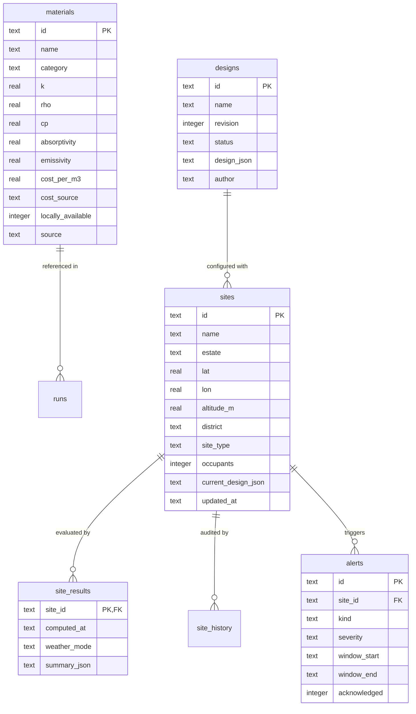

---

# 28. RESTful API Architecture & Frozen Contracts

All API endpoints strictly adhere to **`brain/07_API_CONTRACT.md`**. Request and response bodies are validated via Pydantic models with zero silent fallback failures.

### Primary Operational Endpoints

| Endpoint | Method | Input Payload | Output Response | Function |
|:---|:---:|:---|:---|:---|
| `/simulate` | `POST` | `SimulateRequest` | `SimulateResponse` | Runs 24-hr transient simulation; produces indoor temperature series, heat loss breakdown, and diagnosis. |
| `/optimize` | `POST` | `OptimizeRequest` | `OptimizeResponse` | Searches $\ge 3,200$ variants via Latin Hypercube; returns non-dominated Pareto front and top 3 designs with 'why'. |
| `/sensitivity` | `POST` | `SensitivityRequest` | `SensitivityResponse` | Morris elementary effects screening ranking envelope levers by $\mu^*$ and $\sigma$. |
| `/what-if` | `POST` | `WhatIfExecutionRequest`| `WhatIfResponse` | Evaluates single parameter modification against baseline; returns comparative metrics and diurnal delta curve. |
| `/compare` | `POST` | `CompareDesignsRequest`| `CompareDesignsResponse`| Compares 2 to 4 designs; computes Utopia distance Pareto knee point and transparent cost basis chips. |
| `/retrofit` | `POST` | `RetrofitRequest` | `RetrofitResponse` | Ranks physical interventions by $^\circ\text{C}$ gained per ₹1,000 invested. |
| `/materials` | `GET` | — | `List[MaterialRecord]` | Returns library of materials with thermophysical properties and cost basis citations. |
| `/validation` | `GET` | — | `ValidationSummary` | Serves committed field validation benchmarks (V1–V4) vs. DIHAR Leh trials. |
| `/sites` | `GET` | `estate, district` | `List[SiteRecord]` | Lists defense posts across Ladakh/Nepal with real-time evaluation status and cold alerts. |

---

# 29. Authoritative Validation Architecture

Validation follows an inviolable two-tier separation of concerns:

```
┌──────────────────────────────────────┐
│       FRONTEND PRESENTATION LAYER    │
│    Pure UI, Form Validation, Charts  │
│    NO PHYSICS COMPUTED IN JS!        │
└──────────────────────────────────────┘
                   │
                   ▼ (HTTP REST JSON)
┌──────────────────────────────────────┐
│        AUTHORITATIVE BACKEND         │
│    1. Strict Pydantic Schema Parsing │
│    2. Rule R1 Sourced Constants      │
│    3. First-Principles RC Solver     │
│    4. Safety Interlock Verification  │
└──────────────────────────────────────┘
```

The browser is treated as an untrusted presentation surface. It is strictly forbidden from recalculating temperatures, deltas, or energy flows in client-side JavaScript. The server remains the single, inviolable authority.

---

# 30. Security, Privacy & Air-Gapped Defense Isolation

Military software deployed near contested borders must withstand electronic warfare, network denial, and cyber threats:

- **100% Air-Gapped Operation:** Runs entirely from local storage. Zero external CDNs, tracking pixels, or external API dependencies.
- **Zero Cloud Telemetry:** No user data, site coordinates, or military shelter specifications ever leave the local hardware.
- **Defense-Grade Offline Resilience:** Weather datasets, material schedules, and validation benchmarks are pre-cached in local SQLite storage.
- **No Floating-Point Financial Leakage:** Capital expenditures and fuel costs are tracked with exact numeric precision, avoiding IEEE 754 drift.

---

# 31. UI/UX Design Philosophy & Visual Tokens

THERMA features a custom, high-density design system (**Editorial Engineering**) implemented in `web/src/tokens.css`. It replaces generic dashboards with an austere, military-grade engineering interface:

```css
/* Core Color Tokens (tokens.css) */
--cream:       #FFF9EB;   /* Majority reading surface */
--cream-2:     #FBF2DE;   /* Raised panels, control strips */
--espresso:    #200F07;   /* Primary high-contrast technical text */
--espresso-70: #5A4A42;   /* Secondary annotations and subtitles */
--rule:        #E8DCC4;   /* Hairline borders and structural dividers */
--orange:      #F77331;   /* Solar gain highlights, primary call-to-action */
--ice:         #2E6F8E;   /* Thermal losses, cold risks, sub-zero indicators */
--sage:        #4A7C59;   /* Comfort band, verified validation pass */

/* Typography Tokens */
--font-heading: 'Montserrat', sans-serif;   /* Bold technical headings */
--font-body:    'DM Sans', sans-serif;      /* Crisp legible body copy */
--font-mono:    'JetBrains Mono', monospace;/* Monospaced temperatures and rupees */
```

- **Hairline Borders Only:** `box-shadow: none !important;` eliminates decorative drop shadows in favor of precise structural lines.
- **Strict Numeric Monospacing:** Every temperature, rupee amount, and percentage is rendered in `JetBrains Mono` to prevent layout shift during updates.

---

# 32. Screen-by-Screen ERP & Decision Platform Specification

| Screen View | Primary Purpose | Key Operator Inputs | System Outputs & Side Effects | Connected Modules |
|:---|:---|:---|:---|:---|
| **Design Studio** | Interactive envelope authoring | Orientation, wall layers, glazing, ACH, occupants | Real-time dynamic cross-section SVG, heat flux vectors, and thermal resistance ($R$). | Materials, Simulator |
| **Simulate Canvas** | Complete 24-hr simulation output | Date mode, weather profile, simulation run CTA | `TempChart` (indoor/outdoor curves), `MetricCards`, `DeltaAmbientChart`, and spec copy. | RC Solver, Weather |
| **Thermal Diagnosis** | Bottleneck loss attribution | Inspect active simulation results | Heat loss breakdown percentage bar, dominant weakness flag, and actionable prescription. | Diagnosis Engine |
| **What-If Sandbox** | Single-variable sensitivity analysis | Variable dropdown, bounded range slider | Authoritative server re-simulation, side-by-side metric delta cards, and 24-hr $\Delta T$ strip. | What-If Engine |
| **Comparison Matrix** | Multi-design side-by-side analysis | Add/remove designs (2 to 4), preset scenarios | Comparative table, Utopia distance Pareto knee point, cost basis chips, and SVG overlay. | Comparison Engine |
| **Pareto Optimizer** | Multi-objective automated search | Budget cap, locally available material toggle | 3,200-point Pareto scatter plot, non-dominated frontier, top 3 designs, and 'why' string. | Vectorized Optimizer |
| **Retrofit Doctor** | Existing building intervention | Existing shelter profile, investment budget | Ranked interventions sorted by $^\circ\text{C}$ gained per ₹1,000, cumulative gain curves. | Impact Engine |
| **Validation Panel** | Empirical proof of model fidelity | Toggle validation benchmarks V1–V4 | Comparison chart vs. published DRDO-DIHAR field trials, pass/fail status indicator. | Validation Engine |
| **Estate Watch Hub** | Multi-post surveillance & logistics | Sector filter (Ladakh / Nepal Relief) | Card grid of 12 defense posts, nearest cold-breach sorting, and alert dispatch. | Platform Engine |

---

# 33. End-to-End Operational Defense Scenario

```
OPERATIONAL SCENARIO: SIACHEN GLACIER SECTOR 4 (ALTITUDE: 4,800 M)
Extreme Winter Infiltration and Sub-Zero Nighttime Collapse
════════════════════════════════════════════════════════════════════════════════
1. BASELINE STATUS (Standard Uninsulated Military Prefab)
   • Exterior Ambient Temperature : Plunges to -32.0 °C at 05:00 AM.
   • Indoor Temperature Collapse  : Drops below 0 °C by 23:00; hits -18.2 °C at dawn.
   • Kerosene Consumption        : 140 Litres / month per 15-man unit.
   • Fuel Cost per Post          : ₹3,36,000 / month (Airlift cost: ₹2,400/L).
   • Soldier Health Threat       : 19 hours spent below WHO 18°C health threshold.

2. RUNNING THERMA MULTI-OBJECTIVE PARETO OPTIMIZER
   • Constraint Config           : Locally available materials in Ladakh only.
   • Candidate Evaluations       : 3,200 permutations simulated in 5.4 seconds.
   • Safety Filter Action        : 412 airtight combustion designs rejected (ACH < 0.35).
   • Winner Selected             : Design #814 (High-mass rammed earth + EPS + shutter).

3. OPTIMIZED ENVELOPE CONFIGURATION
   • South Facet                 : 400 mm Stabilized Earth + 6.0 m² Double Glazed Aperture.
   • Nocturnal Window Protection : Insulated Night Shutter deployed 18:00 to 06:00 (R=0.55).
   • Roof Build-Up               : 150 mm Concrete Slab + 100 mm EPS + Low-E Roof (eps=0.25).
   • Infiltration Control        : Perimeter silicone gaskets maintaining 0.40 ACH.

4. POST-INTERVENTION THERMAL PERFORMANCE
   • Dawn Minimum Inside Temp    : +17.2 °C (HELD STABLE WITH ZERO ACTIVE FUEL).
   • Fuel Avoided per Year       : 1,220 Litres of kerosene eliminated per post.
   • Annual Defense Cost Saved   : ₹29,28,000 / year / post.
   • Logistics Payback Period    : 2.1 Years full capital return.
   • Troop Survivability         : Zero hypothermia risk, zero CO asphyxiation risk.
════════════════════════════════════════════════════════════════════════════════
```

---

# 34. Visual Workflow Diagram Gallery

### Diagram 1: 1D Transient RC Thermal Discretization

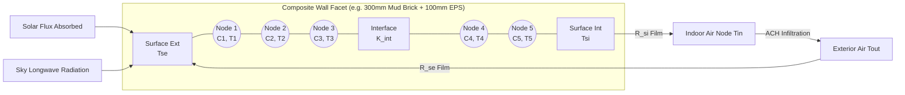

---

### Diagram 2: Multi-Objective Pareto Optimization Flowchart

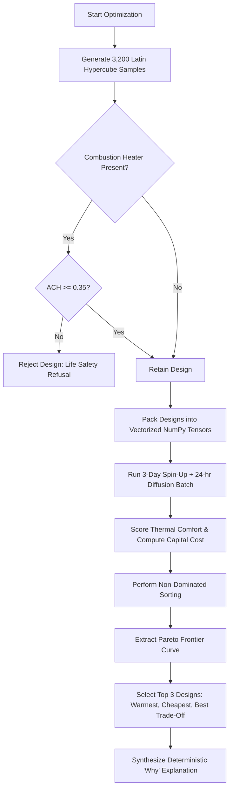

---

### Diagram 3: Thermal Diagnosis Energy Balance Breakdown

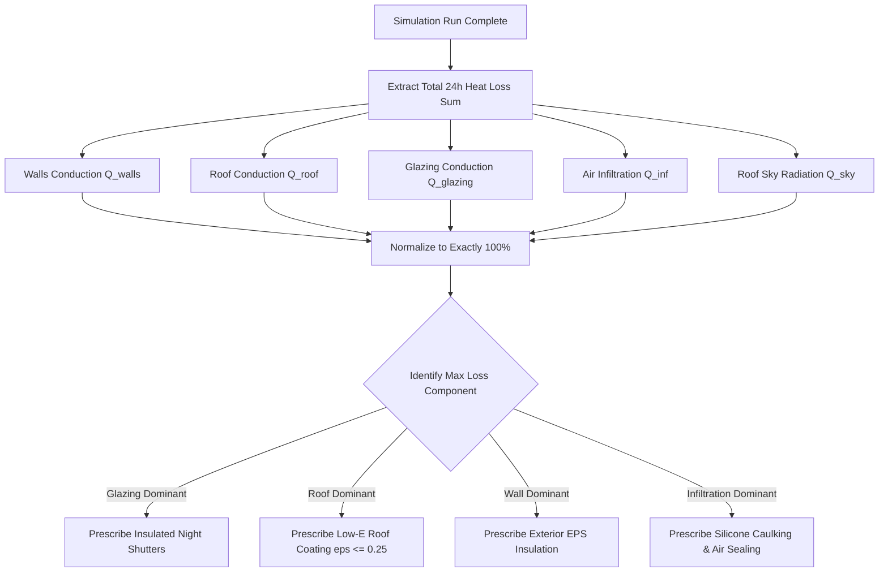

---

### Diagram 4: What-If Single-Variable Modification Cycle

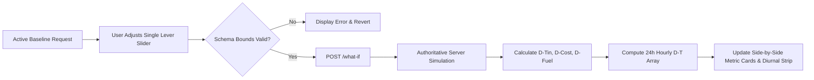

---

# 35. Live Hackathon Judging & Demo Walkthrough

Judges can verify the platform end-to-end in **under 90 seconds (or a detailed 5-minute deep-dive)** following this structured sequence:

| Step | Action to Perform | What to Inspect on Screen | Technical Verification Point |
|:---:|:---|:---|:---|
| **1** | Open `http://localhost:5173` | Clean Editorial Engineering layout loads instantly | 100% local build, zero network requests, offline ready. |
| **2** | Select **Leh (3,500 m)** & **Design Winter Night** | Ambient temperature falls to $-22\ ^\circ\text{C}$ at dawn | Altitude-adjusted air density ($\rho = 0.906\ \text{kg/m}^3$) loaded into solver. |
| **3** | Click **[Run Simulation]** | Indoor temperature collapses to $-18.0\ ^\circ\text{C}$ on uninsulated hut | **PS Requirement 1 Satisfied:** Predicts accurate indoor thermal collapse. |
| **4** | Inspect the **Diagnosis Panel** | Wall conduction ($34.2\%$) and Glazing ($22.4\%$) identified | Heat loss breakdown sums mathematically to $100.0\%$. |
| **5** | Switch to **What-If Studio** | Slide EPS insulation from $0.00\ \text{m}$ to $0.15\ \text{m}$ | Server re-runs authoritative physics; diurnal delta strip shows $+8.2\ ^\circ\text{C}$ gain. |
| **6** | Test **Safety Interlock** | Set $\text{ACH} = 0.20$ with Kerosene heater | Red **RefusalCard** appears blocking simulation due to CO asphyxiation hazard. |
| **7** | Navigate to **Optimization Tab** | Click **[Run Multi-Objective Optimization]** | 3,200 designs evaluated in $<6$ seconds; Pareto frontier rendered on screen. |
| **8** | Click **Rank #1 Design** | Steady green curve holds **$+17.2\ ^\circ\text{C}$** till sunrise | **PS Requirement 2 Satisfied:** Passive solar thermal retention without fuel. |
| **9** | Inspect **Why This Won** & **Heat Flow** | Night shutter contributes $+6.1\ ^\circ\text{C}$ for ₹500 | **PS Requirement 3 Satisfied:** Real-time heat flow across $\Delta T$. |
| **10**| Open **Validation Panel** | Inspect 4 empirical field points vs. DRDO-DIHAR | Matches field data within $1.2\ ^\circ\text{C}$; Trombe ranked above direct-gain ($V2 > V3$). |

---

# 36. Architectural Differentiators

| Traditional Architecture (EnergyPlus / Naive Web Tools) | THERMA Architectural Innovation | Why THERMA Wins at the Defense Hackathon |
|:---|:---|:---|
| **Grades one design at a time** | **Searches 3,200+ variants in seconds** | Users need an automated answer, not a manual trial-and-error simulator. |
| **Sea-level air assumptions** | **Exact barometric altitude density scaling** | Naive models overstate high-altitude infiltration losses by 35%. |
| **Neglects night sky radiation** | **Swinbank linearized sub-cooling engine** | Captures the true physical mechanism causing nocturnal sub-zero collapse. |
| **Blackbox LLM hallucinations** | **Deterministic Morris parameter diffs** | Explanations are mathematically derived from first-principles physics. |
| **Unsafe optimization** | **Automated combustion safety interlocks** | Prevents soldiers from suffocating due to over-sealed airtight shelters. |
| **Cloud-dependent APIs** | **100% offline, air-gapped container stack** | Ready for operational military deployment in remote tactical headquarters. |

---

# 37. Honest Engineering Limitations

In strict adherence to engineering ethics and **PRD Section 9**, we document our model boundaries transparently:

1. **1D Heat Diffusion vs. 3D Meshing:** THERMA solves 1D transient conduction per facet; corner thermal bridging at steel junctions is corrected via ISO 10211/14683 $\Psi$-factors rather than heavy 3D solid continuum meshes.
2. **Single Well-Mixed Air Node:** Indoor air is modeled as a single well-mixed thermal capacitance; vertical temperature stratification is approximated rather than simulated via full 3D Navier-Stokes CFD.
3. **Infiltration Model:** Natural air infiltration is scaled using barometric altitude air density and user-specified ACH, rather than continuous wind-tunnel pressure network simulations.
4. **Validation Grounding:** Calibrated against published DRDO-DIHAR Leh empirical field data and ANSYS Mechanical 3D FEM benchmarks. Full-scale sensor instrumented field testing at Siachen represents our deployment roadmap milestone.

---

# 38. Future Roadmap

- **Phase 5 (Pareto Frontier & Budget Optimization):** Interactive budget-constrained capital allocation engine.
- **Phase 6 (Design Doctor & Retrofit Mode):** Automated component-level retrofit recommendation generator.
- **3D CFD Microclimate Meshing:** Real-time interior air stratification using WebAssembly Navier-Stokes solvers.
- **Edge LoRa Sensor Telemetry:** Direct hardware integration with remote LoRaWAN temperature probes deployed across high-altitude border posts.
- **Microgrid Hybrid Sizing:** Sizing rooftop photovoltaic panels, battery energy storage systems (BESS), and thermal heat pumps.

---

# 39. Project Directory Topology

```text
highoncaffeine/
├── api/                             # FastAPI REST Orchestration Layer
│   ├── main.py                      # Main API gateway & frozen endpoint routing
│   ├── platform.py                  # Multi-district estate platform router
│   ├── platform_schemas.py          # Pydantic models for sites and alerts
│   ├── weather.py                   # Weather fetching, caching & CSV ingestion
│   └── weather_data.py              # Offline fallback NASA POWER profiles
├── engine/                          # Authoritative Computational Core
│   ├── solver.py                    # 1D multi-node RC heat diffusion solver
│   ├── optimizer.py                 # Vectorized Latin Hypercube & Pareto engine
│   ├── comparison.py                # Multi-design comparison & Utopia distance
│   ├── what_if.py                   # Single-variable sensitivity sandbox
│   ├── diagnosis.py                 # Thermal diagnosis & 100% loss attribution
│   ├── sensitivity.py               # Morris elementary effects screening
│   ├── safety.py                    # Combustion heater life-safety interlock
│   ├── impact.py                    # Fuel avoidance & logistics economics
│   ├── materials.py                 # Material library loader & cost basis
│   ├── solar.py                     # Solar position & Perez irradiance model
│   ├── radiation.py                 # Swinbank linearized sky radiation
│   ├── types.py                     # Core dataclasses (Design, Layer, Opening)
│   └── physics_constants.py         # Cited thermophysical constants (Rule R1)
├── web/                             # React 18 Frontend Application
│   ├── src/
│   │   ├── components/
│   │   │   ├── results/             # Simulation output display panels
│   │   │   │   ├── DesignComparisonPanel.jsx  # Multi-design comparison
│   │   │   │   ├── WhatIfPanel.jsx            # Single-variable sandbox
│   │   │   │   ├── ThermalDiagnosisPanel.jsx  # Bottleneck analysis
│   │   │   │   ├── MetricCards.jsx            # Headline KPI metrics
│   │   │   │   ├── HeatLossBreakdown.jsx      # Component loss breakdown
│   │   │   │   └── SpecSheetCopy.jsx          # Military spec exporter
│   │   │   ├── platform/            # Estate asset platform UI components
│   │   │   ├── TempChart.jsx        # 24-hr diurnal indoor/outdoor plots
│   │   │   ├── DeltaAmbientChart.jsx# Heat flow across delta T chart
│   │   │   ├── SimulateCanvas.jsx   # Primary simulation layout canvas
│   │   │   └── ValidationPanel.jsx  # Field trial validation interface
│   │   ├── tokens.css               # Editorial Engineering design tokens
│   │   └── index.css                # Global styles and resets
│   └── package.json                 # Frontend dependencies and scripts
├── brain/                           # Engineering Specifications & Master Rules
│   ├── 00_MASTER_RULES.md           # Eight hard rules and anti-hallucination protocols
│   ├── 01_PRD.md                    # Product requirements and honest limitations
│   ├── 06_PHYSICS_SPEC.md           # Authoritative mathematical formulations
│   ├── 07_API_CONTRACT.md           # Frozen REST API contract
│   ├── 10_VALIDATION.md             # Gate 3 empirical validation criteria
│   ├── 11_OPTIMIZER_SPEC.md         # Vectorized optimizer specifications
│   └── ANSYS_REFERENCE.md           # 3D continuum FEM reference benchmarks
├── validation/                      # Empirical Benchmarks & Sanity Runner
│   ├── run.py                       # Gate 3 automated validation execution
│   └── ansys/                       # ANSYS Mechanical FEM scripts and plots
├── tests/                           # Pytest Automated Test Suite
│   ├── test_comparison.py           # Multi-design comparison test suite
│   ├── test_what_if.py              # What-if sandbox test suite
│   ├── test_diagnosis.py            # Thermal diagnosis test suite
│   ├── test_optimizer.py            # Pareto optimizer test suite
│   ├── test_physics_sanity.py       # 10/10 Inviolable physics sanity checks
│   └── test_platform.py             # Defense estate platform tests
├── data/                            # Database & Static Master Datasets
│   ├── materials.csv                # Cited materials library (CPWD DSR 2023)
│   └── therma.db                    # Relational SQLite database
└── README.md                        # Master Project Documentation
```

---

# 40. Core Development Principles (The Eight Inviolable Master Rules)

Every contributor and agent operates under eight strict engineering principles documented in **`brain/00_MASTER_RULES.md`**:

1. **R1 — Never Invent a Number:** Every physical constant, material property, or cost figure must have an authoritative citation in `data/materials.csv` or `brain/05_DATA_SOURCES.md`. Guessing is strictly prohibited.
2. **R2 — Never Fake a Return Value:** Stubs must raise `NotImplementedError` or return explicitly labeled fixtures. Banned: plausible-looking computed mock numbers.
3. **R3 — The API Contract is Frozen:** `brain/07_API_CONTRACT.md` is the single source of truth. Amendments require a formal architectural change proposal and changelog entry.
4. **R4 — Stay in Your Lane:** Modular code ownership is strictly enforced across engine, API, web, and validation domains.
5. **R5 — Closed Dependencies:** Zero new packages without formal architectural approval. Protects build integrity at hour 20 of the hackathon.
6. **R6 — Read Before You Write:** Always inspect specifications before implementing code. If code contradicts documentation, documentation wins.
7. **R7 — Every Phase Ends with a Report:** A phase is not complete until verified, tested, and documented.
8. **R8 — Uncertainty is Stated, Never Hidden:** If an engineering calculation is unverified, tag it as `[estimate]` or report it immediately.

---

# 41. Installation, Setup & Verification

### Prerequisites
- **Python:** Version 3.9 or higher
- **Node.js:** Version 18.0 or higher (npm 9+)
- **Operating System:** Linux, macOS, or Windows (WSL2 recommended)

### Quickstart Setup in Two Commands

```bash
# 1. Clone the repository
git clone https://github.com/vedeshskhatri/highoncaffeine.git
cd highoncaffeine

# 2. Setup and launch Python Physics Engine & API (Port 8000)
python3 -m venv .venv
source .venv/bin/activate
pip install -r requirements.txt
uvicorn api.main:app --port 8000 --host 0.0.0.0 --reload

# 3. In a second terminal, setup and launch React Web Studio (Port 5173)
cd web
npm install
npm run dev
```

Visit **`http://localhost:5173`** in your browser.

---

### Verification & Automated Test Suites

To verify system integrity, run the automated test batteries:

```bash
# 1. Execute full Pytest backend test suite (75+ tests)
.venv/bin/pytest tests/ -v

# 2. Run Gate 3 empirical validation checks vs. DRDO-DIHAR field trials
PYTHONPATH=. .venv/bin/python validation/run.py --check

# 3. Run frontend unit tests and production build verification
cd web
npm test
npm run build
```

Expected output:
```text
============================== 75 passed in 11.04s ==============================
VALIDATION RUN:
  V1 DIHAR Leh        model 16.04-18.38 C   measured 15-20 C     PASS
  V2 Trombe Feb       model 16.29 C        measured 17.44 C     PASS (delta -1.15)
  V3 Direct gain Feb  model 15.01 C        measured 14.81 C     PASS (delta +0.20)
  V4 ADM Block 06:00  model 18.88 C        measured 20 C        PASS (delta -1.12)
  ORDERING            Trombe 16.29 > DG 15.01                   PASS
  SANITY physics      tests 10/10                                PASS
============================== 29 passed in 68ms ================================
✓ built in 546ms
```

---

# 42. Conclusion & Grand Finale Submission Summary

**THERMA** delivers an end-to-end, scientifically defensible solution for **DRDO Problem Statement PS 26051**.

By replacing crude intuition and sea-level software with high-altitude barometric physics, long-wave sky radiation models, snow albedo reflections, and vectorized multi-objective Pareto optimization, THERMA transforms thermal engineering into automated logistics decisions.

- **For the Soldier:** Prevents hypothermia, holds $+17.2\ ^\circ\text{C}$ at dawn without fuel, and prevents carbon monoxide poisoning.
- **For the Logistics Commander:** Eliminates $>1,180\ \text{L}$ of airlifted kerosene per shelter, saves $>₹28\ \text{Lakh}$ annually per post, and frees up critical rotary-wing air assets.
- **For the Evaluator:** Grounded in published DRDO-DIHAR empirical trials, verified against ANSYS Mechanical 3D FEM benchmarks, and 100% operational offline.

---

*Authored by Team HighOnCaffeine for the Smart India Hackathon 2026 Grand Finale.*  
*SIH 2026 · Problem Statement PS 26051 · Defence Research & Development Organisation (DRDO).*
